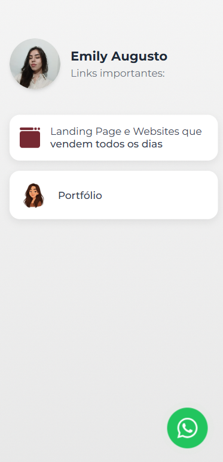

# Página de Links (Link in Bio) - Emily Augusto

### Acesso

A página está hospedada no GitHub Pages e pode ser acessada através do link abaixo:

[**https://emilyaugusto.github.io/LinkBioEmilyAugusto/**](https://emilyaugusto.github.io/LinkBioEmilyAugusto/) 


###

## 📖 Sobre o Projeto

Este é um projeto de uma página de links (conhecida como "link in bio") criada para centralizar os principais contatos e portfólios de Emily Augusto de forma elegante e acessível. A página foi desenvolvida para ser visualmente agradável e totalmente responsiva, adaptando-se perfeitamente a dispositivos móveis e desktops.

O objetivo é oferecer uma experiência de usuário limpa e direta, ideal para ser usada em perfis de redes sociais como o Instagram.

## ✨ Funcionalidades

* **Design Limpo e Moderno:** Interface minimalista e focada no conteúdo, com um fundo sutil de gradiente e ruído.
* **Animações Suaves:** Efeito de "fade-in" nos elementos ao carregar a página para uma primeira impressão mais dinâmica.
* **Botão de Contato Flutuante:** Acesso rápido para o WhatsApp com uma animação de "pulso" para chamar a atenção.
* **Responsividade:** Layout otimizado para uma experiência de visualização perfeita em celulares, tablets e desktops.
* **Ícone Personalizado (Favicon):** Para fácil identificação da página na aba do navegador.

## 🛠️ Tecnologias Utilizadas

Este projeto foi construído utilizando as seguintes tecnologias web:

* **HTML5:** Para a estrutura e semântica do conteúdo.
* **CSS3:** Para a estilização, animações e o design responsivo.
  * **Tailwind CSS:** Um framework CSS "utility-first" para agilizar a criação do layout.
* **JavaScript:** Para a lógica das animações de carregamento da página.

## ⚙️ Como Utilizar ou Personalizar

Caso queira utilizar este projeto como base, siga os passos abaixo:

1.  **Clone o repositório:**
    ```bash
    git clone [https://github.com/emilyaugusto/LinkBioEmilyAugusto.git](https://github.com/emilyaugusto/LinkBioEmilyAugusto.git)
    ```

2.  **Navegue até a pasta do projeto:**
    ```bash
    cd LinkBioEmilyAugusto
    ```

3.  **Faça as alterações:**
    * Abra o arquivo `index.html` para alterar textos, links, a foto de perfil e o número do WhatsApp.
    * Abra o arquivo `style.css` para personalizar cores, fontes e outros aspectos visuais.
    * O arquivo `script.js` controla as animações, que podem ser ajustadas conforme necessário.

4.  **Abra o `index.html` no seu navegador** para visualizar as mudanças localmente.
